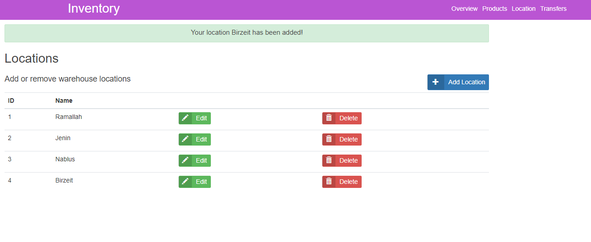

# Inventory Management System using flask

## Get Started


## Clone this repository and follow the steps to run the app.

```
git clone https://github.com/mousamajdi/Inventory-Manager.git
cd Inventory-Manager
```

### Prerequisites

To run this system you will need :
- Python 3
- Flask
- SQLALCHEMY
- WTForms

you can install the prerequisites using the command below on your directory:

```
pip3 install -r requirements.txt
```

## Running the app
1) Set your current path to where the cloned folder is and run the file **run.py**

2) check into *localhost:5000/*

## Features

### Adding/Editing Products 
product name and quantity need to be filled.


### Adding/Editing Locations
location name and quantity need to be filled.





### Deleting Products and Locations
Deleting only requires a button click, although the transfers(if any) will remain in the history.

### Moving products
Here products can be moved to a location, from a location as well as to and from a location. Products need to initially be added to various locations from the central warehouse.


### Editing Products and Locations
Product or loaction name can be changed bu clicking on the edit button.


# Built using
- Flask
- SQLAlchemy

